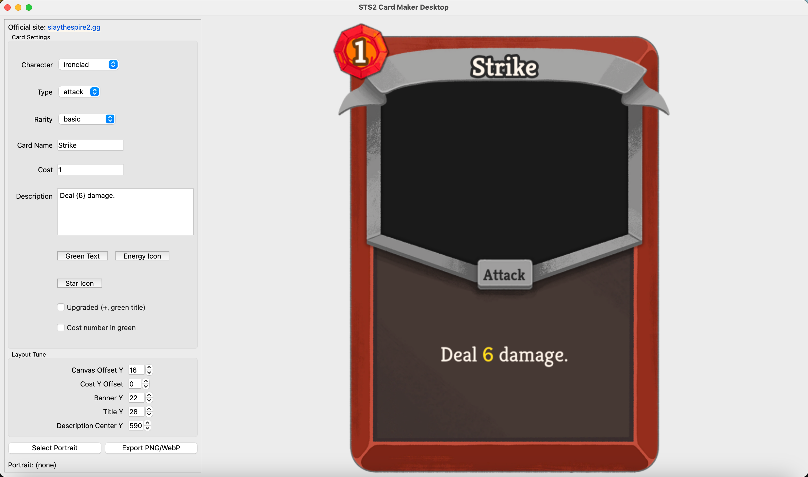

# STS2 Card Maker Desktop

Live Demo: https://slaythespire2.gg/tools/diy-card

Standalone desktop card-maker for Slay the Spire 2 style card rendering (single-card preview + export).

Official website and full database tools: [slaythespire2.gg](https://slaythespire2.gg)

## Goals

- Render one card locally with a GUI preview
- Export PNG or WebP
- Include card-maker related UI assets (frame, banner, icons, inner border)
- Keep project simple and easy to run on a local machine

## Features

- Desktop GUI (PySide6)
- Character, type, rarity, cost, name, description editing
- Upgraded state and green-cost toggle
- Portrait import
- Ancient-specific tune panel (banner/title/art parameters)
- Live preview and one-click export

## Screenshots



## Included assets

This repository includes only card-maker related assets used for rendering:

- frame / banner atlases
- energy icons and star icon
- type plaque
- rendering fonts used by this tool

## Quick start

```bash
cd open-source/sts2-card-maker-desktop
python -m venv .venv
source .venv/bin/activate
pip install -e .
python -m sts2_card_maker
```

You can also run the console script:

```bash
sts2-card-maker
```

## Project structure

```text
assets/
  atlases/
  icons/
  fonts/
  manifest.json
src/sts2_card_maker/
  models.py
  renderer.py
  gui.py
  main.py
```

## Notes

- Live online experience: [https://slaythespire2.gg](https://slaythespire2.gg)

## License

- Code: MIT (see `LICENSE`)
- Included assets: see `ASSET_LICENSE.md`
